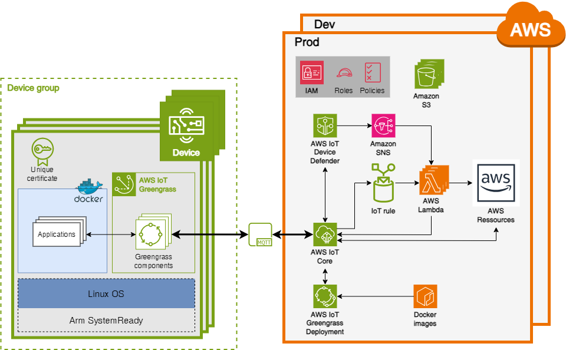
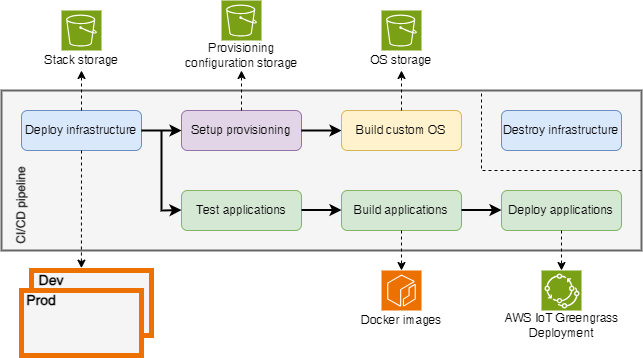
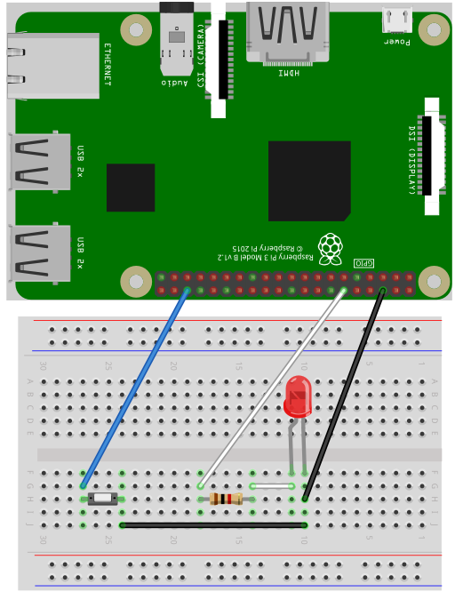

[](https://github.com/56kcloud/aws-iot-reference-architecture/actions/workflows/deploy-infra.yml)
[](https://github.com/56kcloud/aws-iot-reference-architecture/actions/workflows/setup-provisioning.yml)
[](https://github.com/56kcloud/aws-iot-reference-architecture/actions/workflows/build-image.yml)
[](https://github.com/56kcloud/aws-iot-reference-architecture/actions/workflows/test-apps.yml)
[](https://github.com/56kcloud/aws-iot-reference-architecture/actions/workflows/build-apps.yml)
[](https://github.com/56kcloud/aws-iot-reference-architecture/actions/workflows/deploy-apps.yml)

# Cloud-Native IoT Reference Architecture with Arm SystemReady
## About
Cloud-Native IoT Reference Architecture with Arm SystemReady is an open-source project developed as part of a master's thesis to meet the challenges of integrating embedded systems with the cloud. This architecture facilitates the automatic provisioning of a cloud infrastructure and the integration of an embedded system during its initial start-up. Designed for use with AWS, it focuses on essential components while taking advantage of Arm processors and SystemReady certifications. The project aims to streamline collaboration between embedded systems engineers and cloud professionals, allowing them to focus on their end products. By following Cloud-Native best practices, the continuous integration and delivery tools ensure a robust, functional architecture on various Arm-based and SystemReady-certified embedded systems. The ultimate aim is to encourage the creation of a community around this architecture, enabling engineers to adopt it and apply it easily to their projects. In addition, a demonstration is included showing the deployment of a cloud infrastructure on AWS and the automatic configuration of cloud services for seamless interaction with an embedded system, plus data visualisation accessible via a web interface.

## Project overview
### Architecture overview


### CI/CD pipeline overview


## Get started
⚠️ Not all AWS regions are compatible with AWS IoT. The ***eu-central-1*** region has been tested for this reference architecture.

⚠️ In one AWS account, set the same AWS region.

### 1. [Configuring OpenID Connect in Amazon Web Services](https://docs.github.com/en/actions/deployment/security-hardening-your-deployments/configuring-openid-connect-in-amazon-web-services)
**Adding the identity provider to AWS**

1. On your AWS account, go to ***IAM->Identity providers*** and click on ***Add provider*** :
   - For the provider type: select *OpenID Connect*.
   - For the provider URL: Use `https://token.actions.githubusercontent.com`.
     - Click on ***Get thumbprint***.
   - For the "Audience": Use `sts.amazonaws.com` if you are using the [official action](https://github.com/aws-actions/configure-aws-credentials).

**Configuring the role and trust policy**

1. Create an IAM role using a custom trust policy as shown in the following file : [*docs/github-oidc/oidc-ref-arch-role.json*](./docs/github-oidc/oidc-ref-arch-role.json).
   - Replace ***${AWS::AccountId}*** with your AWS account ID.
   - Replace ***${GitHub::user/organization}*** with the user/organization name of your forked repository.
   - Replace ***${GitHub::repository}*** with the name of your forked repository.

2. Create an IAM policy as shown in the following file : [*docs/github-oidc/oidc-ref-arch-policy.json*](./docs/github-oidc/oidc-ref-arch-policy.json). And attach it to the IAM role.
   - Replace ***${AWS::AccountId}*** with your AWS account ID.
   - Replace ***${AWS::Region}*** with the AWS region in which you want to deploy your infrastructure.

### 2. Creation of actions secrets and variables in the GitHub repository
In your GitHub repository, go to ***Settings->Secrets and variables->Actions***.

Create the following secrets :
- **OIDC_ROLE_AWS** : The value is the ARN of your IAM role createted before
- **PULUMI_CONFIG_PASSPHRASE** : Set this as an environment variable to protect and unlock your configuration values and secrets. Your passphrase is used to generate a unique key for your stack, and configuration and encrypted state values are then encrypted using AES-256-GCM.

Create the following variables :
- **AWS_REGION** : Set this by the AWS region in which you want to deploy your infrastructure.
- **IAC_STACK_NAME** : Set this by the stack name. By default, set as `dev` for the [development stack](cloud-infrastructure/Pulumi.dev.yaml), otherwise set as `prod` for the [production stack](cloud-infrastructure/Pulumi.prod.yaml).
- **IAC_BUCKET_NAME** : Set this by a unique name for your bucket used to store the stack of the Infrastructure as Code.
- **CERT_BUCKET_NAME** : Set this by a unique name for your bucket used to store provisioning documents.
- **IMAGE_BUCKET_NAME** : Set this by a unique name for your bucket used to store the custom OS image.

### 3. Set the Pulumi stacks
Set the [development stack](cloud-infrastructure/Pulumi.dev.yaml) in the [Pulumi.dev.yaml](cloud-infrastructure/Pulumi.dev.yaml) file (used by default)
- **iot-ref-arch:aws-account-id** : Set this by the AWS account ID.
- **iot-ref-arch:aws-region** : Set this by the AWS region.

If your are in [production](cloud-infrastructure/Pulumi.prod.yaml), set the [Pulumi.prod.yaml](cloud-infrastructure/Pulumi.prod.yaml) file.

⚠️ The [development stack](cloud-infrastructure/Pulumi.dev.yaml) and the [production stack](cloud-infrastructure/Pulumi.prod.yaml) must be **set in two different** AWS accounts.

### 4. Set the list of authorised devices - *Optional*
If you want to provision a new device directly on AWS after deployment, you must authorise your device. To do this, you must have its serial number and enter it in the [allowlist.txt](cloud-infrastructure/allowlist.txt) file. The [allowlist.txt](cloud-infrastructure/allowlist.txt) file must be written as follows :
```
0123456789
9876543210
0123443210
```
Each line is a new serial number.

### 5. Run workflows
1. Commit and push your modifications ([Pulumi.dev.yaml](cloud-infrastructure/Pulumi.dev.yaml), [Pulumi.prod.yaml](cloud-infrastructure/Pulumi.prod.yaml), [allowlist.txt](cloud-infrastructure/allowlist.txt)), all workflows will run automatically. If you haven't touched these files, you can manually run the [deploy-infra.yml](.github/workflows/deploy-infra.yml) workflow from the GitHub Actions.

All workflows will be executed to deploy the infrastructure, configure provisioning, create the custom OS image and finally test, build and deploy the Greengrass components.

### 6. Flash SD card - *Optional*
1. Once the pipeline has been successfully completed, download the custom OS image from Amazon S3 bucket created with **IMAGE_BUCKET_NAME** name.
2. Flash an SD card with [balenaEtcher](https://etcher.balena.io) or a similar tool (8GB capacity recommended).

### 7. Run device - *Optional*
1. After flashing, insert the SD card into your device, connect it to internet using an Ethernet cable and switch it on.
2. Wait 5 minutes for booting and provisioning.
3. Check whether your device is provisioned on AWS. Go to ***AWS IoT->All devices->Things*** and search for its name defined by its serial number.
4. Enjoy !

⚠️ This reference architecture has only been tested on a Raspberry Pi 4.

## How it works
### Reference architecture
The reference architecture is divided into two parts: the first concerns embedded systems based on Arm architectures and certified Arm SystemReady with a Linux operating system, while the second relates to the cloud and is hosted by the AWS provider.

In the cloud, two distinct infrastructures are presented. The first infrastructure is dedicated to development, enabling all kinds of operations to be tested. The second infrastructure is the production infrastructure, encompassing the final product intended for customers. Each infrastructure uses different AWS services.

The central service managing the IoT is AWS IoT Core, which exchanges data with all connected devices. Its preferred communication protocol is MQTT. Provisioned devices are registered in a specific group within this service. Only authorised devices are provisioned. AWS IoT Greengrass Deployment handles the deployment of new Greengrass components or updates to a group of devices. A component, in the context of AWS IoT Greengrass, is a unit of deployment and execution that encapsulates code, dependencies and resources, making it easy to deploy, manage and update IoT applications. In this architecture, Docker components are used, encapsulating Docker containers to offer greater flexibility in software deployment. Docker images are stored in the Amazon Elastic Container Registry (ECR). Another service, AWS IoT Device Defender, checks daily whether a certificate is about to expire, as each device has a unique certificate enabling a secure connection. If a certificate expires within 30 days, it is replaced by a new one. Other Lambda functions, triggered by rules, can enrich the architecture, as can other AWS resources, depending on the needs of each developer. Storage spaces such as Amazon S3 are used to save the state of the infrastructure, configuration files and OS images. The configuration files contain a list of the serial numbers of all the IoT devices authorised to be provisioned. If a device is not listed and attempts to be provisioned, access will be denied. If a device is already provisioned and its serial number is removed from the list, its access will be withdrawn and it will be deleted from the cloud. The IAM service is there to assign roles and policies, limiting authorised actions on resources to the strict minimum.

Embedded systems must be based on Arm architecture and be Arm SystemReady certified.

> Arm SystemReady is a compliance certification program based on a set of hardware and firmware standards. This ensures that subsequent layers of software also ‘just work’. The compliance certification program tests and certifies that systems meet the SystemReady standards, giving confidence that operating systems (OS) and subsequent layers of software just work. [Source](https://www.arm.com/architecture/system-architectures/systemready-certification-program)

The devices are flashed with a custom Linux OS image, based on the Debian distribution. On first boot, two pieces of software are installed: Docker Engine for running Docker containers, and AWS IoT Greengrass Core for provisioning, communicating with AWS IoT Core and managing Greengrass components. This software provisions the device by exchanging the claim certificate with a unique certificate, securing the connection of the device, which is then registered in the device group. Deployment of Greengrass components from the cloud to devices is automated when a new device is associated or a new version of a component becomes available. Applications are contained in Docker containers to ensure optimum portability.

### CI/CD pipeline
The pipeline is made up of several workflows, each dedicated to a specific function, working on standard runners hosted on GitHub with Ubuntu. Some of these workflows require access to AWS resources. To achieve this, the OpenID Connect identification protocol (OIDC) is used. OIDC enables workflows to interact with AWS cloud service provider resources without having to permanently store credentials as GitHub secrets. Before deploying the infrastructure, the AWS account configuration is adjusted to recognise the GitHub OIDC as a trusted federated identity. [See this section to configure](#1-configuring-openid-connect-in-amazon-web-services)

#### [Deploy infrastructure](.github/workflows/deploy-infra.yml)
This workflow ([deploy-infra.yml](.github/workflows/deploy-infra.yml)) essentially takes care of creating the cloud infrastructure in an AWS account. Just before deployment, a preparation is made. A claim certificate is created and a storage space is also created to save the state of the infrastructure. The claim certificate is created outside the architecture to avoid it changing with each new deployment if there is more than one need for destruction. This prevents devices that are already ready to be provisioned with a claim certificate from becoming unusable.

The infrastructure is deployed using the Pulumi Infrastructure as Code (IaC) tool. This tool is open-source and uses imperative programming languages (Python, Go, C#, etc) to describe and deploy the cloud infrastructure. It uses a status system to track the current state of the deployed infrastructure. This enables Pulumi to understand the differences between the code and the current state and to determine the modifications needed to achieve the desired state of the infrastructure. The state is saved in the Amazon S3 storage space. The infrastructure is the part of the AWS cloud in the [architecture overview](#architecture-overview).

#### Setup provisioning
This workflow ([setup-provisioning.yml](.github/workflows/setup-provisioning.yml)) takes care of preparing configuration files for provisioning in an Amazon S3 storage space. It also manages device control. It checks the list of authorised devices, to identify whether a previously provisioned device has been removed from the list. If so, it will be removed from the cloud provider. It may also be the case that authorised devices are already provisioned and need to be connected to the new infrastructure. This is also checked and carried out.

#### Build custom OS image
This workflow ([build-image.yml](.github/workflows/build-image.yml)) takes care of preparing and creating the OS image with all the files and scripts needed to automatically provision the devices when they are first started up. This workflow uses the Packer image creation tool, with the Packer builder ARM plugin.

Packer acts as an abstraction layer to automate image creation, and the Packer builder ARM plugin extends this functionality to specifically support the Arm architecture. A Docker container provides the isolated environment needed to run these processes consistently. Once the image has been created, it is saved to a dedicated Amazon S3 storage space.

#### Destroy infrastructure
This workflow ([destroy-infra.yml](.github/workflows/destroy-infra.yml)) takes care of destroying the AWS cloud infrastructure. Everything is deleted except the provisioned devices and the claim certificate including the certificate, the private key and the arn of the certificate in the S3 bucket.

Devices that have already been provisioned are not deleted. Only their policy will be removed so that they no longer interact with cloud resources. When a new infrastructure is created, these devices will get a policy again. The claim certificate is kept in case several devices are already ready to be provisioned. If it is not, when a new infrastructure is created, a new claim certificate will be created and the devices ready for provisioning can no longer be provisioned. However, the AWS account and region must remain the same when a new infrastructure is created.

To destroy the infrastructure, you must manually run the [destroy-infra.yml](.github/workflows/destroy-infra.yml) workflow from the GitHub Actions.

#### Test applications
This workflow ([test-apps.yml](.github/workflows/test-apps.yml)) is responsible for conducting tests on applications. Various tests are performed. The first one focuses on linting, conducting a static analysis of the code in applications to identify recurring errors, such as unused variables or libraries. Unit tests are also executed in each of the applications, accompanied by a coverage report. Lastly, security tests are conducted, specifically referred to as Static Application Security Tests (SAST). These tests aim to identify sensitive data that should not be present in a repository.

#### Build applications
This workflow ([build-apps.yml](.github/workflows/build-apps.yml)) takes care of building Greengrass components from applications developed in the [/greengrass-components/applications](./greengrass-components/applications) directory. To ensure that the applications are free of programming languages and as portable as possible, they are run in Docker containers. The first step is to create a Docker image for each application, which are then stored in Amazon ECR. An image is built only if its respective application has been modified between two commits.

The next step involves creating Greengrass components using the Greengrass Development Kit (GDK) CLI tool. From configuration files, Docker images are linked to Greengrass components. The components are first built and then published in AWS IoT Greengrass. Each update to a component creates a new version. A new version of a component is only created if it has been modified between two commits.

However, it is possible to create single components without an application. This is the case for the component used to update the OS ([os_update](./greengrass-components/components/os_update/)). It simply executes the command lines described in its configuration file.

#### Deploy applications
This workflow ([deploy-apps.yml](.github/workflows/deploy-apps.yml)) takes care of deploying Greengrass components to a group of devices. It doesn't matter whether components have been updated or not, deployment takes place in all cases. AWS IoT Greengrass is smart enough to see if a new version of a component has been released. If this is the case, only the component with the new version will be deployed in the device group.

## Demo
1. Develop the electronic circuit as shown in the diagram below.
   - 1x pushbutton (PIN 36)
   - 1x led (PIN 12)
   - 1x resistor (1kOhm)

   
2. Provision a Raspberry Pi 4 by following all the steps in the [Get started](#get-started) section. Wait a few moment for the applications to deploy and for the led to blink.
3. Use the MQTT client test in the AWS console in AWS IoT and subscribe to the following topics to get feedback when you change the frequency or push the button:
   -  `lambda/+/frequency`
   -  `lambda/+/button`
4. Use the MQTT client test and change the frequency of blinking :
   -  Topic: `device/SERIAL_NUMBER/frequency`
   -  Message: 
      ```
      {
         "frequency": 5
      }
      ```
5. Push the button to stop blinking. The led will stop blinking and a message will be sent to MQTT subscriber.
6. To test the certificate rotation, publish an empty message. The AWS IoT Greengrass Core on the device restarts after the certificate change, including all. To see the change, look at the certificate before the test and look at it again afterwards. You will see a new certificate identifier. You can see it in the AWS console (***AWS IoT->Manage->Things->SERIAL_NUMBER***).
   -  Topic: `device/SERIAL_NUMBER/csr_req`
   -  Message: 
      ```
      {}
      ```

## Notes
⚠️ It is possible to change the value of environment variables in [workflows](.github/workflows) (THING_GROUP_NAME for example). If you change one of them, make sure you set the same value in all the workflows that use this variable. Environment variables can be found at the start of each workflow script.

⚠️ The SSH connection is enabled in each device. The username is `pi` and the default password is `welcome`.

⚠️ Don't forget to add the serial numbers of the devices you want to provision to the allow list ([cloud-infrastructure/allowlist.txt](cloud-infrastructure/allowlist.txt)).

## Learn more
- [Pulumi](https://www.pulumi.com)
- [AWS IoT Core](https://docs.aws.amazon.com/iot/latest/developerguide/what-is-aws-iot.html)
- [AWS IoT Greengrass V2](https://docs.aws.amazon.com/greengrass/v2/developerguide/what-is-iot-greengrass.html)
- [Device requirements](https://docs.aws.amazon.com/greengrass/v2/developerguide/setting-up.html#greengrass-v2-requirements)
- [SystemReady Certification Program](https://www.arm.com/architecture/system-architectures/systemready-certification-program)
- [About security hardening with OpenID Connect](https://docs.github.com/en/actions/deployment/security-hardening-your-deployments/about-security-hardening-with-openid-connect)
- [Packer](https://www.packer.io)
- [Packer plugin to build Arm images](https://github.com/mkaczanowski/packer-builder-arm)

## License
This reference architecture is released under the [Apache 2.0 license](./LICENSE).