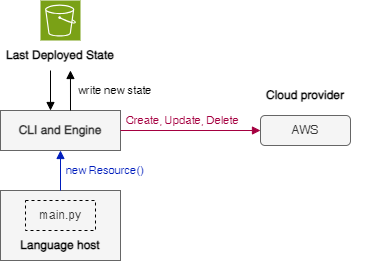

# Cloud infrastructure
## About
The cloud infrastructure is the main part of the reference architecture. Its use in the context of embedded systems offers a number of advantages and functionalities:
- **Scalability**: Cloud infrastructures mean that resources can be dynamically scaled to meet changing needs. This is particularly useful for embedded systems, which can have variable workloads. Resources can be quickly adjusted, whether by increasing computing power, storage or other services, according to the needs of the system.
- **Unlimited storage**: Cloud storage services offer virtually unlimited capacity, eliminating storage constraints on embedded devices, which are often limited in terms of storage space. This makes it possible to store important data, firmware updates, logs and so on.
- **Processing in the cloud** : Computationally intensive or resource-intensive operations can be delegated to the cloud, freeing up the limited resources of embedded systems. This makes it possible to run complex tasks, advanced analyses and even artificial intelligence in the cloud.
- **Easy updates**: Software and firmware updates can be managed centrally from the cloud, simplifying the maintenance process. New versions can be seamlessly deployed to all on-board devices.
- **Connectivity and communication** : Cloud infrastructures offer communication services that facilitate the connectivity of embedded devices to the internet. This enables two-way communication, real-time data transfers and the ability to receive commands remotely.
- **Security and certificate management**: Cloud services provide robust security mechanisms, including certificate management to ensure secure communication between embedded devices and the cloud. Services such as AWS IoT Device Defender provide additional security features.
- **Data processing**: Cloud infrastructures provide data processing services, such as cloud databases, which facilitate the storage and analysis of data generated by embedded systems.
- **Remote management** : Remote management of embedded devices is simplified thanks to cloud interfaces. It's possible to monitor, configure and manage devices remotely, which is particularly useful for large-scale deployments.

## How it works
The infrastructure is deployed using the Pulumi Infrastructure as Code (IaC) tool. This tool is open-source and uses imperative programming languages to describe and deploy the cloud infrastructure.

To understand how this tool works, here are a few concepts:
- **Programming languages** : Pulumi supports several programming languages, including JavaScript, TypeScript, Python, Go, C# and Java. The choice of language is free and there are no constraints.
- **Stacks** : A stack in Pulumi represents a specific environment in which the infrastructure is deployed. For example, there may be one stack for development, another for production, and so on. Each stack has its own configuration and can be managed independently.
- **Resources** : In Pulumi, a "resource" is an abstraction for a unit of work in the cloud infrastructure, such as a Lambda function, an IAM role, or any other component. The Pulumi code describes the resources.
- **State** : Pulumi uses a state system to track the current state of the deployed infrastructure. This allows Pulumi to understand the differences between the code and the current state and to determine what changes are needed to achieve the desired state.
- **Deployment** : When the Pulumi code is launched, the tool analyses the code, compares the current state with the desired state, and makes the necessary changes to align the infrastructure with the code.

In this architecture, there are two stacks: the development stack ([Pulumi.dev.yaml](./Pulumi.dev.yaml)) and the production stack ([Pulumi.prod.yaml](./Pulumi.prod.yaml)). In each of these files, you need to configure the AWS account ID and the region where the infrastructure is to be deployed. The tool's main configuration file is [Pulumi.yaml](./Pulumi.yaml). It specifies the name of the infrastructure and the programming language used.

The chosen programming language is Python. Its main file is [main.py](./__main__.py). It contains mainly the IoT resources. The [iam.py](./iam.py) script contains all the resources linked to IAM, such as roles and policies. The other Python scripts correspond to Lambda functions that are deployed in the infrastructure. The Python libraries needed to code the infrastructure can be found in the [requirements.txt](./requirements.txt) file.

As additional information, Pulumi stores the state of the stack in an Amazon S3 storage space.

## Notes
⚠️ The [development stack](./Pulumi.dev.yaml) and the [production stack](./Pulumi.prod.yaml) must be **set in two different** AWS accounts.

## Learn more
- [Pulumi](https://www.pulumi.com)