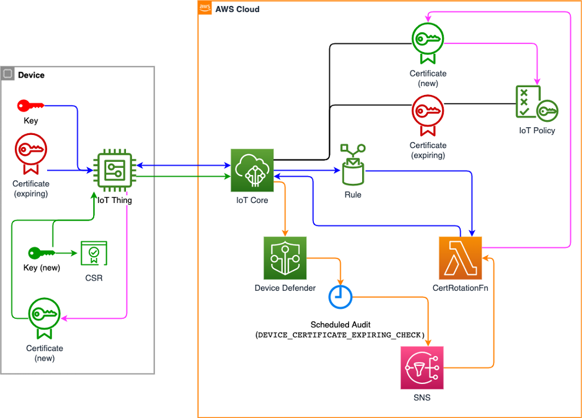

[](https://github.com/56kcloud/aws-iot-reference-architecture/actions/workflows/test-apps.yml)
[](https://github.com/56kcloud/aws-iot-reference-architecture/actions/workflows/build-apps.yml)
[](https://github.com/56kcloud/aws-iot-reference-architecture/actions/workflows/deploy-apps.yml)
[](https://github.com/PyCQA/bandit)

# Greengrass components
## [About](https://docs.aws.amazon.com/greengrass/v2/developerguide/greengrass-components.html)
Greengrass AWS IoT components are software modules that are deployed on Greengrass base devices. Components can represent applications, runtime installers, libraries, or any code that is executable on a device. Components can depend on other components. For example, one component installs Python and other components depend on it to run Python applications. When components are deployed on a fleet of devices, Greengrass only deploys the software modules that the devices need.

Here are some key points about AWS Greengrass components:

1. **Definition of a Greengrass component** : A component can be defined as a combination of code (for example, a Python application), software dependencies and system resources. This can include libraries, configuration files, executables, etc.
2. **Component management** : AWS IoT Greengrass enables centralised management of components. Components can be created, published and managed in AWS IoT Greengrass and deployed to groups of Greengrass devices.
3. [**Component types**](https://docs.aws.amazon.com/en_en/greengrass/v2/developerguide/develop-greengrass-components.html#component-types) : There are several types of components in AWS IoT Greengrass:
   - **Nucleus** (`aws.greengrass.nucleus`) : The Greengrass nucleus is the component that provides the minimum functionality of the AWS IoT Greengrass Core software.
   - **Generic** (`aws.greengrass.generic`) : The Greengrass nucleus runs a generic component's lifecycle scripts, if the component defines a lifecycle. This type is the **default type** for custom components.
     - Docker containers can be run as part of a lifecycle.
   - **Lambda** (`aws.greengrass.lambda`) : The Greengrass nucleus runs a Lambda function component using the Lambda launcher component.
4. **Deployment** : Components are deployed on groups of Greengrass devices to run device-side applications. Deployments are orchestrated and managed from the Greengrass AWS IoT service.
5. **Versioning** : Components can be versioned, enabling different versions of software to be managed and updates to be deployed in a controlled way.

## Applications
### Certificate rotator application
This application provide change a device's certificate when it expires. It runs in a Docker container. An overview is shown in the figure below ([source](https://aws.amazon.com/fr/blogs/iot/how-to-manage-iot-device-certificate-rotation-using-aws-iot/)) :


How it works:
  1. Identify devices with certificates which are going to expire on a daily basis
  2. Device generates a new Certificate Signing Request (CSR)
  3. New device certificate is created and sent to the device
  4. Expiring certificate is deleted from the device and the AWS cloud

### Led application
This application is not essential to the reference architecture. It is used as a demonstration for MQTT communication with AWS IoT. It is an application in a Docker container that blinks an external led on the Raspberry Pi 4. The blinking frequency can be adjusted from an application associated with AWS IoT using the MQTT protocol. Blinking can also be enabled or disabled from the [button application](#button-application). Two pieces of data, the blink frequency and the blink state, are transmitted to AWS IoT so that they can be viewed on an interface.


### Button application
This application is connected to the [led application](#led-application) while retaining its independence. It is designed as a demonstration of local MQTT communication. Also running in a Docker container, it simply interacts with the [led application](#led-application) to activate or deactivate the blinking of the led. The user presses an external button built into the Raspberry Pi 4 to reverse the blinking state.

### Corrupt application
This is an application in a Docker container that print "Corrupt Docker container". It can't print because it's broken. The platform architecture configured (amd64) in the Dockerfile is differente from the target architecture (arm64). It is created to show that the state of health of the device returned to AWS will not be good because of a component malfunction.

## OS update
A component ([os_update](./components/os_update/)) is present for the sole purpose of updating OS features. In its configuration file ([recipe.yaml](./components/os_update/recipe.yaml)), a section is dedicated to the script used to run Linux commands:
```
# if there is no {configuration:/update_no}, this is the 1st time
if [ ! -f {configuration:/update_no} ] ; then
    touch {configuration:/update_no}

    # Write your commands
    apt-get update
    # shutdown -r now
else
    echo "Already updated."
fi
```
The commands to be executed must be written below the ***# Write your commands*** comment. The device can be restarted after the commands have been executed with `shutdown -r now`.
It is important that the update version is changed each time this component is modified. This is changed in the configuration file [recipe.yaml](./components/os_update/recipe.yaml) with the `update_no` variable. This allows update commands to be run only once per version.

⚠️ When the device reboots, the Greengrass components also reboot. The `update_no` variable is therefore used to prevent the restart command (`shutdown -r now`) from running in a loop.

## How it works
### Applications
The directory to create a new application is [greengrass-components/applications](./applications/). An application is built as follows :
```
docker_app_1
  ├── app_1
  └── Dockerfile
```
**Dockerfile** is a configuration file used to create a Docker image.
- **FROM** image : base image for the build
- **COPY** path dst : copy path from the context into the container at location dst
- **CMD** args : set the default command (e.g. application run command)

**app_1** contains the core of the application with its tests. The programming language can be freely chosen. It is enough to manage how the application will be launched with the **CMD** command when the container is started.

In the [led](./applications/docker_led/), [button](./applications/docker_button/) and [certificate rotator](./applications/docker_certificate_rotator/) applications, the language used is Python. The **CMD** command executes a bash script which installs the dependencies and runs the application.

### Components
The directory to create a new Greengrass component is [greengrass-components/components](./components/). A component is built as follows :
```
docker_app_1
  ├── gdk-config.json
  └── recipe.yaml
```
**gdk-config.json** is the configuration file required to set up the GDK CLI tool.

**recipe.yaml** is the configuration file required to set up the component. It describes the details of the component, such as its name, version, dependencies, lifecycle scripts, resource requirements, etc.

### Deployment template
Before Greengrass components are deployed, a deployment file is generated from the [deployment.json.template](./components/deployment.json.template) template. This file specifies the group of devices to be deployed to and the components to be deployed. If you want to use a specific version of the Greengrass nucleus component, you can add it to the template along with its version. You can also add other components from the AWS public components.

## Notes
⚠️ The structure of the Greengrass components must be as follows:
```
greengrass-components
├── applications
├   ├── docker_certificate_rotator
├   ├   ├── certificate_rotator_app
├   ├   └── Dockerfile
├   └── docker_app_1
├   ├   ├── app_1
├   ├   └── Dockerfile
├   └── docker_app_2
├       ├── app_2
├       └── Dockerfile
└── components
    ├── os_update
    ├   ├── gdk-config.json
    ├   └── recipe.yaml
    └── docker_certificate_rotator
    ├   ├── gdk-config.json
    ├   └── recipe.yaml
    └── docker_app_1
    ├   ├── gdk-config.json
    ├   └── recipe.yaml
    └── docker_app_2
        ├── gdk-config.json
        └── recipe.yaml
```

⚠️ The component directory name (`/components/docker_app_1/`) must be the same as the application directory name (`/applications/docker_app_1/`).

⚠️ The led and button applications are only functional on a Raspberry Pi because of the GPIO libraries used, which are specific to this environment (`RPi.GPIO` library).

## Learn more
- [Greengrass components](https://docs.aws.amazon.com/greengrass/v2/developerguide/greengrass-components.html)